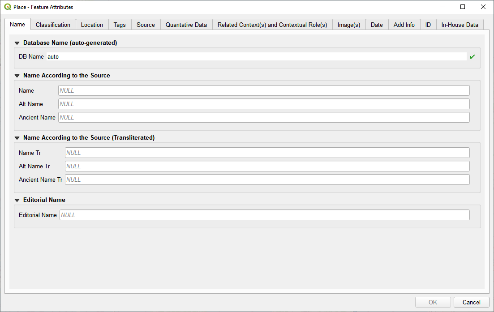

# Place Form
## Name Tab

|Field Name (QGIS)|Field Name (DB)|Status|some field title|
|--|--|--|--|
|DB Name|place_name|non-editable|Auto-generated name, based on ...|
|Name|place_name_src|editable|Place name as written in the source, e.g. اسثانبول, Burtzia, Татаръ-кьой, etc.|
|Alt Name|place_name_src_alt|editable|Alternative place name as written in the source|
|Ancient Name|place_name_src_ancient|editable|Ancient place name as written in the source|
|Name Tr|place_name_src_transl|editable|Place name transliterated in Roman script according to the usual transliteration rules for the respective language|
|Alt Name Tr|place_name_src_alt_transl|editable|Alternative place name transliterated in Roman script according to the usual transliteration rules for the respective language|
|Ancient Name Tr|place_name_src_ancient_transl|editable|Ancient place name transliterated in Roman script according to the usual transliteration rules for the respective language|
|Editorial Name|place_name_editorial|editable|If the source provides no place name and the user estimates that the auto-generated place name, based on class (and eventually subclass) won’t be clear enough for a human to understand, they can provide a name by themselves|
